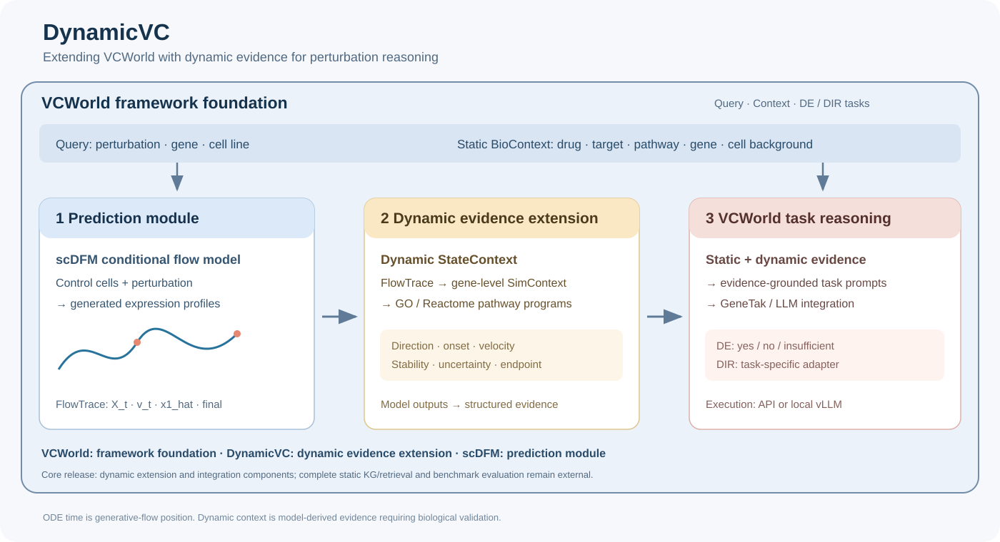

# DynamicVC

### 基于 VCWorld 的动态证据增强扰动推理

[English](README.md) · [运行指南](docs/dynamic_vc_pipeline.md) · [项目叙事与架构说明](docs/project_story.zh-CN.md) · [MIT 许可](LICENSE)

**DynamicVC 以 VCWorld 框架为底座，为其生物学推理流程补充模型生成的动态证据。** 项目沿用 VCWorld 的查询、上下文组织与 DE/DIR 任务框架，接入单细胞扰动预测模块，将推理轨迹整理为基因级 **SimContext** 和 GO/Reactome 通路证据，形成 **Dynamic StateContext**，与 **Static BioContext** 共同支持 LLM 推理。当前的 flow 预测模块采用 scDFM。

整个项目围绕一个问题展开：**如何让 VCWorld 同时利用静态生物知识与模型动态证据，回答扰动相关问题？** VCWorld 确定查询和任务，DynamicVC 通过三条技术主线补充证据：**预测响应 → 构建动态证据 → 在 VCWorld 中融合证据并推理**。



## 框架与组件的层级关系

| 层级 | 组件 | 在项目中的角色 |
| --- | --- | --- |
| **框架底座** | **VCWorld** | 组织生物学查询、静态上下文、证据融合与 DE/DIR 推理任务 |
| **动态证据扩展** | **DynamicVC** | 向框架中加入 FlowTrace、基因级 SimContext 与通路程序 |
| **预测模块** | **scDFM** | 提供当前使用的条件 flow model 和细胞响应预测 |
| **任务/模型接入** | **GeneTak 与 LLM runners** | 将任务提示词接入兼容模型，通过 API 或本地 vLLM 生成回答 |

这个核心仓库收录动态扩展和部分框架集成组件；静态 KG 构建/检索、完整 benchmark 评估仍通过外部组件接入。

## 三条主线，一套证据流

| 主线 | 回答的问题 | 核心实现 | 输出 |
| --- | --- | --- | --- |
| **1. 单细胞扰动预测** | 给定对照细胞和扰动，模型预测怎样的表达响应？ | scDFM 条件 flow model、训练与 ODE 推理 | 预测表达谱，以及可选的 FlowTrace |
| **2. 动态证据与通路扩展** | 基因状态沿生成轨迹怎样变化，涉及哪些通路？ | FlowTrace → SimContext → GO/Reactome 富集 | 基因级和通路级结构化证据 |
| **3. VCWorld 证据融合与 DE/DIR 推理** | 动态预测与静态知识共同支持怎样的判断？ | VCWorld 任务提示词 + 动态证据、API / vLLM 批量生成 | 回答文本、归一化标签和可选的选项分数 |

### 1. 预测层：以 flow model 提供动态证据来源

scDFM 是 VCWorld 框架内接入的预测模块，根据对照表达、扰动身份和基因身份学习条件向量场。`predict_y` 训练路径使用噪声到目标表达的插值，并可加入分布层面的 MMD 损失；推理时从初始噪声出发，在对照表达的条件下积分，生成预测表达谱。

这条主线可以独立训练、预测和评估。DynamicVC 在推理入口增加可选的 **FlowTrace** 导出，记录多个 ODE 时刻的状态 `X_t`、速度 `v_t`、局部终点估计 `x1_hat` 和最终预测。

入口：[训练示例](run.sh)、[训练/推理脚本](src/script/run.py)、[配置](config/config_flow.py)。

### 2. 证据层：将 FlowTrace 转换为 SimContext 和通路上下文

FlowTrace 保留数值轨迹，SimContext 将轨迹整理成以 `(perturbation, gene, cell_line)` 为索引的结构化描述，包括相对对照的偏移、变化方向、轨迹模式、沿 flow 的起始位置、速度模式、方向稳定性和不确定性启发式指标。

随后，GO/Reactome 富集按照保存的 ODE 时刻和上/下方向分别执行，将单个基因的变化扩展为通路层面的上下文。**基因级 SimContext + 通路级证据**共同构成加入 VCWorld 证据上下文的 **Dynamic StateContext**。

入口：[FlowTrace → SimContext](src/script/build_simcontext_from_trace.py)、[通路富集](src/script/enrich_simcontext_programs.py)。

### 3. 推理层：在 VCWorld 中融合静态与动态证据

VCWorld 以“某扰动对某细胞系中某基因的影响”为查询单位，组织任务及药物、靶点、通路、基因和细胞背景等 **Static BioContext**。DynamicVC 的注入器在这一流程内补入同一查询对应的 Dynamic StateContext。GeneTak 任务/模型接入及现有 runner 将增强后的提示词交给 Gemini/OpenAI 兼容接口或本地 vLLM。

- **DE**：是否发生差异表达。
- **DIR**：响应方向是什么。
- **证据充分性**：现有证据能否支持该判断。

当前两个 runner 的归一化/选项评分体系是 `yes / no / insufficient`，其中 API runner 的评分提示词明确针对 DE。DIR 提示词可用于生成回答；要将结果稳定输出并评估为独立的 `UP / DOWN / NO CHANGE` 类别，还需要任务适配。详见[任务接口说明](docs/dynamic_vc_pipeline.md#de-and-dir-task-contract)。

入口：[提示词注入](src/script/inject_simcontext_into_de_prompts_v2.py)、[API 批量推理](vcworld/pipeline/batch_gemini_infer.py)、[vLLM 批量推理](VCworld_Data/batch_vllm_infer.py)。

## 阅读仓库的顺序

| 阅读目标 | 位置 |
| --- | --- |
| 理解模型如何训练、预测和导出轨迹 | [`src/script/run.py`](src/script/run.py) |
| 理解数据准备、划分和采样 | [`src/data_process/data.py`](src/data_process/data.py) |
| 理解当前使用的模型 | [`src/models/instantiate_model.py`](src/models/instantiate_model.py)、[`src/models/origin/model.py`](src/models/origin/model.py) |
| 理解轨迹如何变成基因证据 | [`build_simcontext_from_trace.py`](src/script/build_simcontext_from_trace.py) |
| 理解基因证据如何变成通路证据 | [`enrich_simcontext_programs.py`](src/script/enrich_simcontext_programs.py) |
| 理解证据如何进入下游任务 | [`inject_simcontext_into_de_prompts_v2.py`](src/script/inject_simcontext_into_de_prompts_v2.py) |
| 理解不同 LLM 的运行与输出 | [`batch_gemini_infer.py`](vcworld/pipeline/batch_gemini_infer.py)、[`batch_vllm_infer.py`](VCworld_Data/batch_vllm_infer.py) |

现有目录和入口继续使用原路径。`src/models/` 包含继承的模型组件，当前工厂函数实际暴露的模型类型是 `origin`。

## 如何开始

在已安装 NumPy、pytest 的 Python 3.10+ 环境中，从仓库根目录运行后处理 smoke tests：

```bash
python -m pytest -q tests/test_dynamic_vc_pipeline.py
```

两个测试覆盖合成轨迹转换、基础富集与提示词格式化，不需要 GPU、真实数据或 API 密钥。模型训练、checkpoint 推理和下游模型运行参见[完整运行指南](docs/dynamic_vc_pipeline.md)。

`environment.yml` 是继承的 Linux/CUDA 训练环境导出；本地 vLLM 需要单独准备兼容环境。H5AD、checkpoint、KG、任务提示词和结果文件由使用者提供，仓库保留可复用源代码。

## 项目定位与实现边界

DynamicVC 在 VCWorld 框架内，将预测、轨迹解释和任务推理连成可追溯的证据链。ODE 时间表示生成过程中的位置，速度表示模型向量场，不能直接解释为实验时间或 RNA velocity。SimContext 的标签与通路富集是模型证据，其生物学有效性和下游收益需要实验评估。

仓库已包含预测、轨迹导出、SimContext、富集、提示词注入和批量生成。框架中的静态 KG 构建/检索、完整 DE/DIR benchmark 评估、联合 DE/DIR/confidence 结构化输出属于外部组件或后续适配范围。

## 框架底座与组件来源

**VCWorld 是 DynamicVC 的框架底座。** DynamicVC 在其证据组织与推理流程中引入动态状态和通路上下文，GeneTak 与 LLM runners 提供任务/模型接入。

当前预测模块来自 [scDFM](https://github.com/AI4Science-WestlakeU/scDFM)。其模型代码、训练示例和素材保留上游归属，使用该模块时请保留[英文 README 中的组件引用](README.md#framework-foundation-and-component-attribution)。数据与 checkpoint 链接见[上游资源](docs/dynamic_vc_pipeline.md#upstream-resources)。代码沿用 [MIT 许可](LICENSE)。
